# 📊 Visualizaciones: Diagramas y Dashboards de Modelos

> Representaciones visuales de estructuras de mercado y modelos de competencia.

## 📑 Catálogo de Visualizaciones

1. [Estructuras de Mercado](#estructuras-de-mercado)
2. [Modelo de Cournot](#modelo-de-cournot)
3. [Modelo de Bertrand](#modelo-de-bertrand)
4. [Modelo de Stackelberg](#modelo-de-stackelberg)
5. [Teoría de Juegos](#teoría-de-juegos)

---

## Estructuras de Mercado

### Clasificación de Mercados

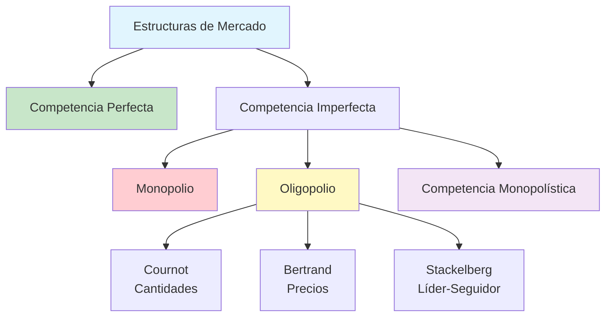

### Comparación de Eficiencia

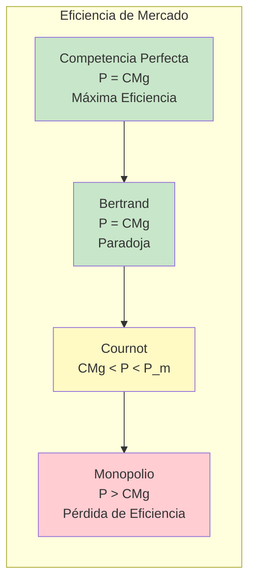

---

## Modelo de Cournot

### Funciones de Reacción

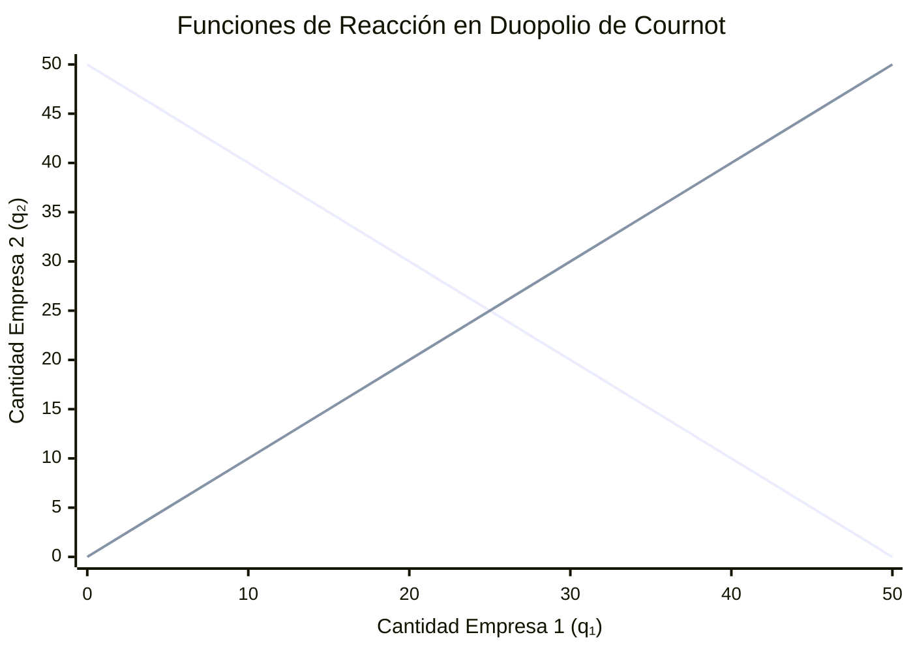

### Proceso de Decisión Cournot

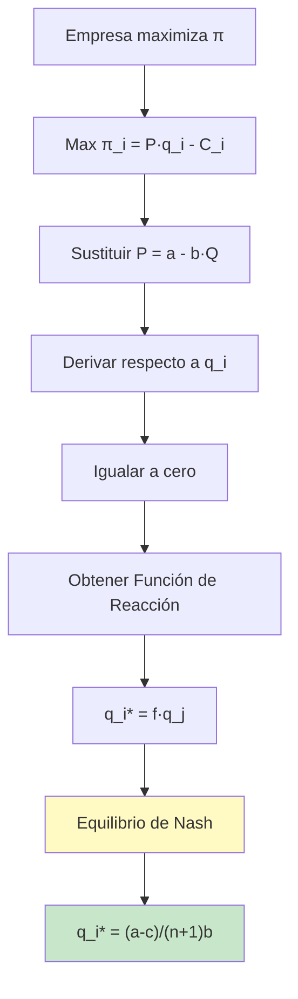

---

## Modelo de Bertrand

### Paradoja de Bertrand

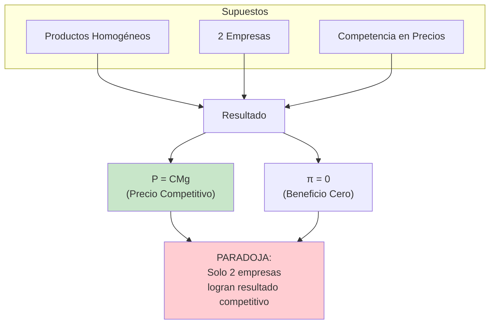

### Soluciones a la Paradoja

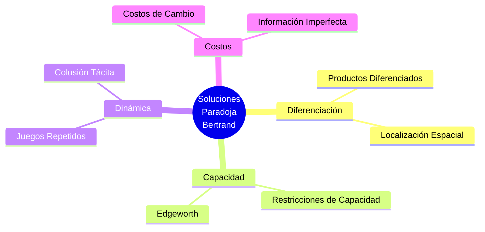

---

## Modelo de Stackelberg

### Secuencia de Decisiones

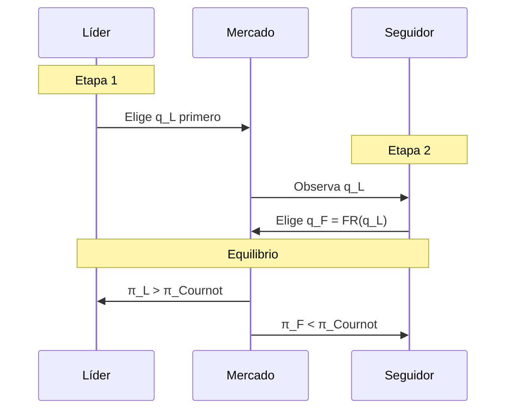

### Comparación de Resultados

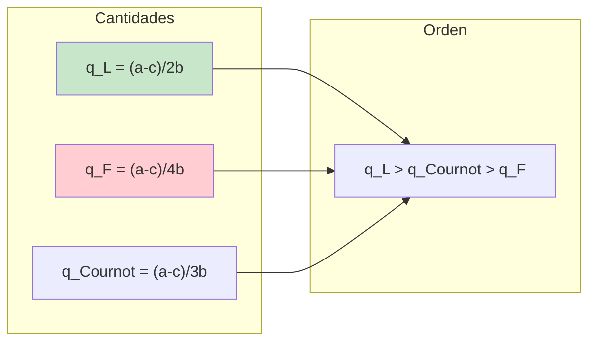

---

## Teoría de Juegos

### Dilema del Prisionero (Colusión)

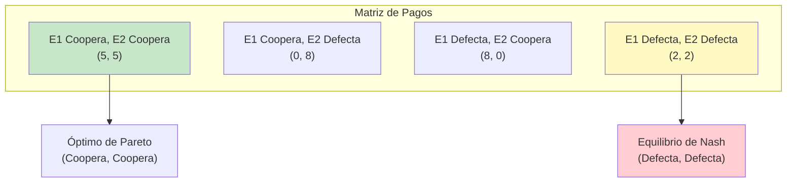

### Árbol de Juego Secuencial

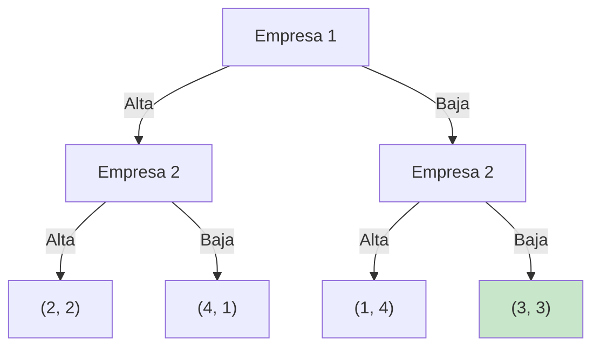

---

## 📊 Dashboard: Comparación de Modelos

### Resumen Visual

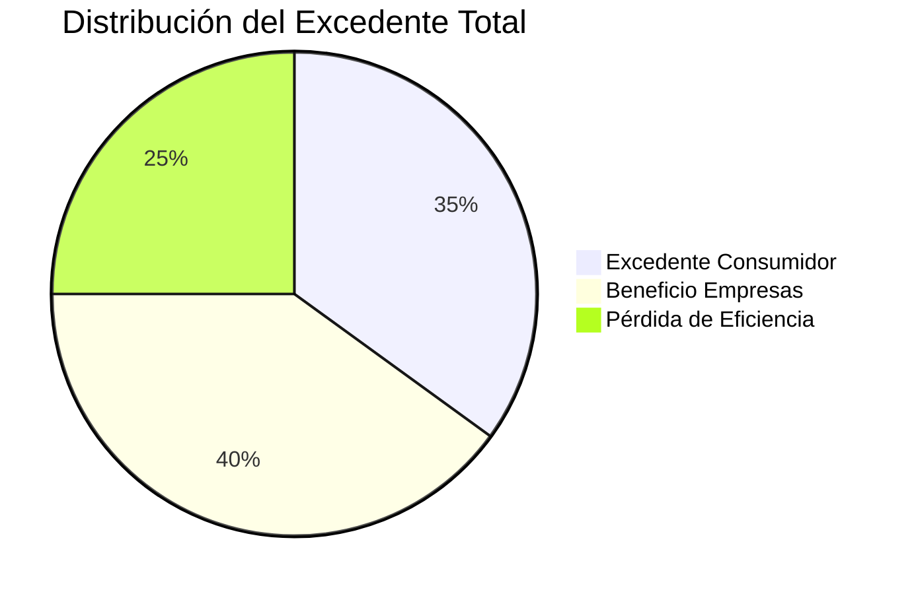

### Jerarquía de Precios

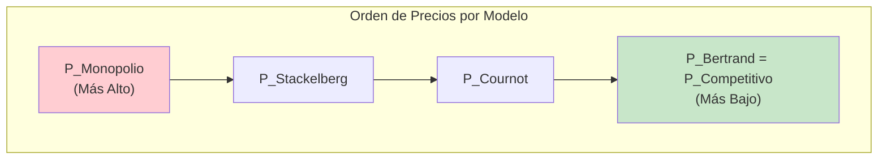

---

## 🎨 Uso de Diagramas

Los diagramas Mermaid se renderizan automáticamente en GitHub. Para verlos:
1. Navega a este archivo en GitHub
2. Los diagramas se mostrarán como imágenes interactivas

Para editar o crear nuevos diagramas, consulta la [documentación de Mermaid](https://mermaid.js.org/intro/).
